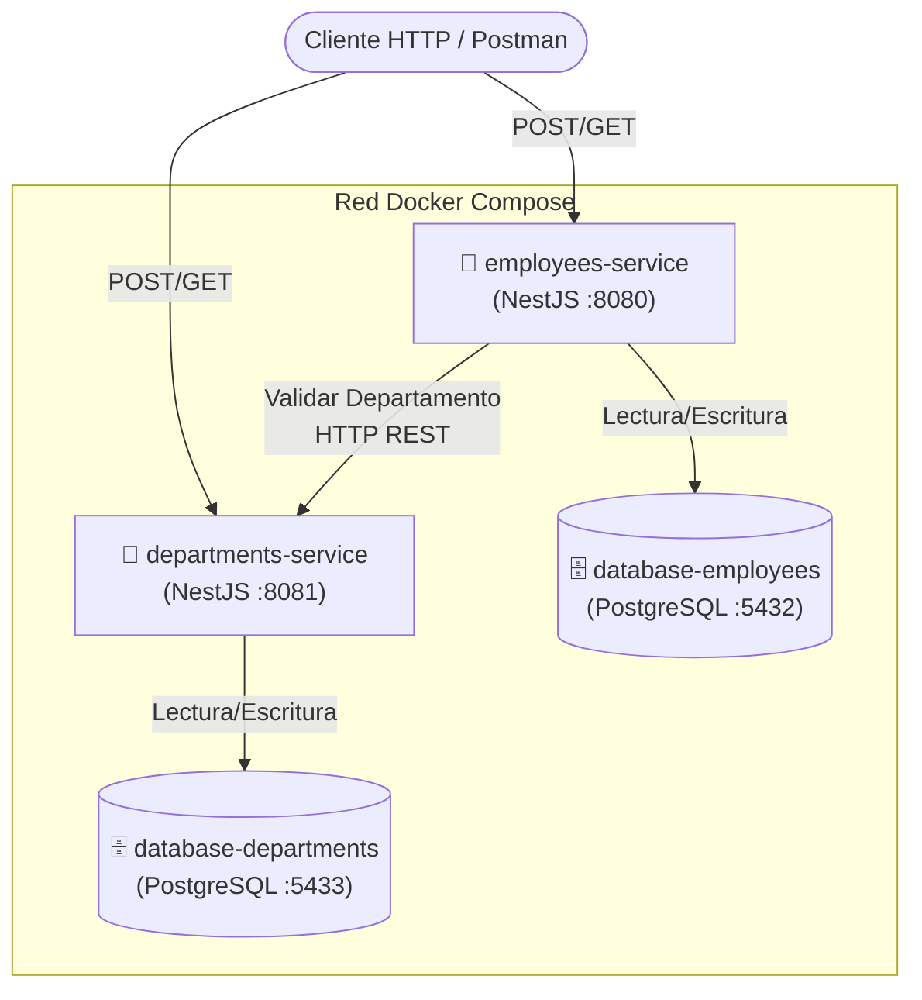
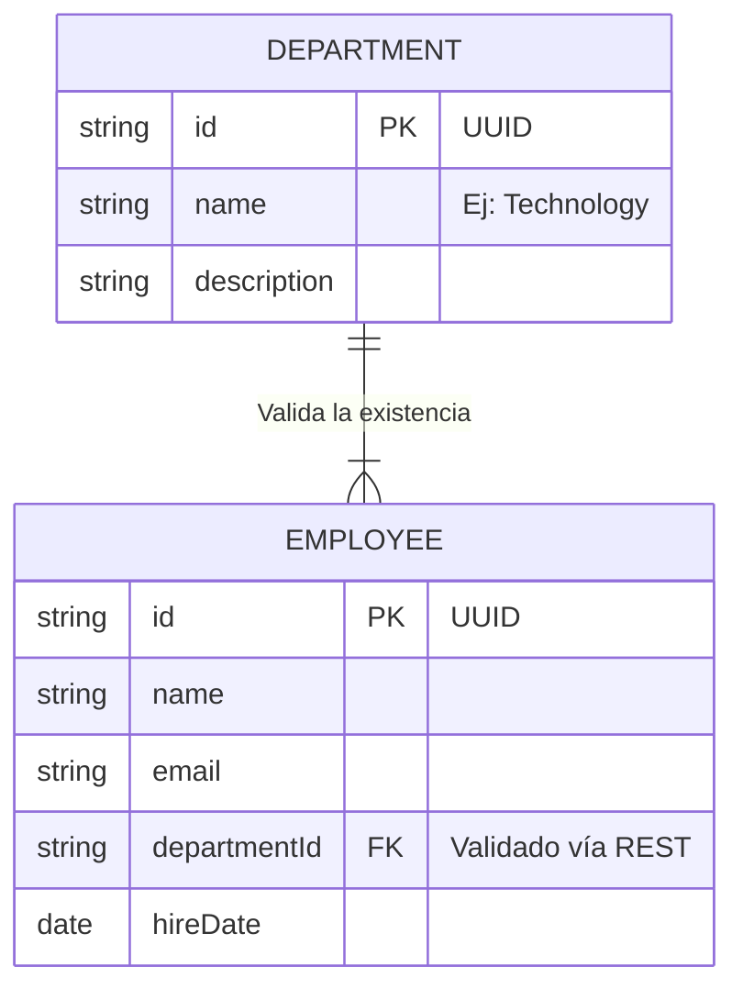

# Entorno: Retos de Microservicios (Challenges)

> **⚠️ ATENCIÓN AGENTE IA:**  
> Este entorno está destinado **únicamente** a la resolución de los retos incrementales de la materia de microservicios. Todas las aplicaciones que generes aquí deben adherirse estrictamente al stack y arquitecturas definidas a continuación.

## 🎯 Objetivo de este Entorno
El propósito es construir progresivamente un sistema básico de onboarding de empleados. Se divide en retos donde se evalúa el despliegue en contenedores, la orquestación (Docker Compose), persistencia (Bases de Datos independientes) y comunicación básica (REST).

## 🛠️ Stack Tecnológico Restringido
Para todas las aplicaciones dentro de este entorno debes usar:
* **Backend:** Node.js con **NestJS** y **TypeScript**
* **ORM:** **TypeORM**
* **Base de Datos:** **PostgreSQL**
* **Documentación API:** **Swagger** (`@nestjs/swagger`)
* **Contenedores:** Docker y Docker Compose

---

## 🏛️ Arquitectura de Referencia (Reto 2)

Los retos evolucionarán desde un solo servicio monolítico (Reto 1) hasta un par de microservicios orquestados (Reto 2). A continuación, se presenta la arquitectura objetivo a la que debes llegar:

---

## 💾 Modelo de Datos y Diagrama ER

---

## 🤖 Instrucciones para el Asistente IA (Tú)

1. **Nomenclatura en Inglés Requerida:** Todo el código, variables, nombres de archivos, carpetas, entidades de base de datos y *rutas de Endpoints* (ej. `/employees` no `/empleados`) deben estar obligatoriamente en **Inglés**. Utiliza convenciones estándar (`camelCase`, `kebab-case`, `PascalCase` según el contexto en NestJS).
2. **Lee primero los PDFs de los retos:** Almacenados en esta carpeta `reto1.pdf` y `reto2.pdf`.
3. **Detalles del Reto 1 (Servidor Web Básico):** Si el usuario te pide iniciar el **Reto 1**, concéntrate en construir únicamente el microservicio `employees-service`.
    - Debe exponer `POST /employees` y `GET /employees/:id`.
    - Aunque el PDF del Reto 1 dice que la BD no es obligatoria, prepáralo usando estructuras en memoria **o** TypeORM + PostgreSQL de una vez si el usuario lo prefiere, ya que el siguiente reto lo exigirá obligatoriamente.
    - Debe incluir un único `Dockerfile` exponiendo el puerto 8080.
4. **Detalles del Reto 2 (Orquestación y Persistencia):** Si el usuario te pide avanzar al **Reto 2**:
    - Genera el archivo `docker-compose.yml` en la raíz.
    - Crea un nuevo servicio `departments-service` con operaciones CRUD completas y su respectivo `Dockerfile`.
    - Obligatoriamente debes conectar tanto el servicio de empleados como el de departamentos a sus respectivas instancias de **PostgreSQL** independientes usando volúmenes de Docker. La persistencia en memoria ya no es válida.
5. **Comunicación:** La comunicación entre `employees-service` y `departments-service` (cuando un empleado se registra, debe validar que el departamento existe) es **Sincrónica por HTTP REST** consumiendo el endpoint del servicio destino. No implementes RabbitMQ ni Kafka aquí.
6. **Swagger Requerido:** Toda API construida en ambos retos debe estar documentada. Agrega decoradores de `@nestjs/swagger` obligatoriamente en cada controlador para facilitar las pruebas del usuario.
