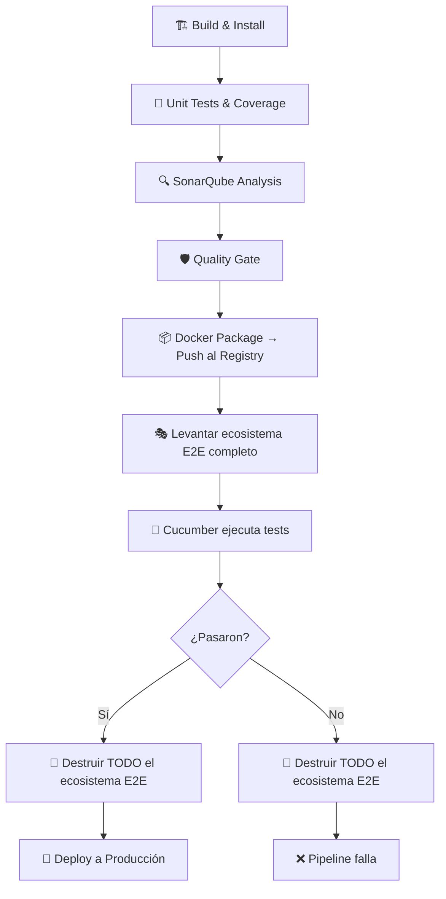

# Estrategia de E2E y Despliegue en Producción

## Contexto

El proyecto incluye un servicio `bdd-tests` definido en `docker-compose.yml` con el perfil `bdd`. Este servicio tiene como dependencias todos los microservicios del ecosistema. Al activar el perfil, Docker Compose levanta **todo el ecosistema completo de forma efímera** (microservicios + bases de datos + RabbitMQ + runner de tests), ejecuta las pruebas Cucumber y luego permite destruir todo.

---

## 1. Principio Fundamental

> **Todo el ecosistema de E2E es efímero.**

Cuando Jenkins ejecuta las pruebas E2E, debe levantar una instancia temporal y aislada de **todos** los microservicios, bases de datos y el message broker. Esto garantiza que:

- Se prueban los **cambios reales** recién compilados, no una versión vieja que estaba corriendo.
- El entorno de test es idéntico al de producción (mismas imágenes, misma configuración).
- No hay interferencia con otros entornos (desarrollo local, staging, producción).
- Al finalizar, todo se destruye sin dejar residuos.

---

## 2. ¿Cómo funciona el perfil `bdd`?

El servicio `bdd-tests` tiene `profiles: [bdd]` y `depends_on` hacia todos los microservicios. Cuando se ejecuta:

```bash
docker compose --profile bdd up --build
```

Docker Compose hace lo siguiente automáticamente:

1. **Levanta las bases de datos** (sin perfil → siempre incluidas).
2. **Levanta RabbitMQ** (sin perfil → siempre incluido).
3. **Espera los healthchecks** de BDs y RabbitMQ.
4. **Construye y levanta los microservicios** con los cambios más recientes del workspace.
5. **Construye y levanta `bdd-tests`** (perfil `bdd` activado).
6. **Cucumber ejecuta** todas las pruebas contra el ecosistema recién levantado.

Al destruir con `docker compose --profile bdd down -v`:

1. Se detienen y eliminan **todos** los contenedores (microservicios + BDs + tests).
2. Se eliminan los volúmenes temporales (`-v`), garantizando datos limpios en la próxima ejecución.

```
┌──────────────────────────────────────────────────────────┐
│              Entorno E2E Efímero (todo temporal)          │
│                                                           │
│  ┌─────────┐ ┌──────────┐ ┌─────────┐ ┌──────────────┐  │
│  │ auth-db │ │employees │ │dept-db  │ │notifications │  │
│  │         │ │   -db    │ │         │ │     -db      │  │
│  └────┬────┘ └────┬─────┘ └────┬────┘ └──────┬───────┘  │
│       │           │            │              │          │
│  ┌────▼────┐ ┌────▼─────┐ ┌───▼──────┐ ┌────▼───────┐  │
│  │  auth   │ │employees │ │  depts   │ │notifications│  │
│  │ service │ │ service  │ │ service  │ │  service    │  │
│  └────┬────┘ └────┬─────┘ └───┬──────┘ └────┬───────┘  │
│       │           │            │              │          │
│       └───────────┴──────┬─────┴──────────────┘          │
│                          │                               │
│                   ┌──────▼──────┐                        │
│                   │  bdd-tests  │  ◄── Cucumber BDD      │
│                   │  (perfil)   │                        │
│                   └─────────────┘                        │
│                                                           │
│  Todo se destruye al finalizar: docker compose down -v    │
└──────────────────────────────────────────────────────────┘
```

---

## 3. Flujo Completo del Pipeline



### Etapas detalladas

| # | Etapa | Agente | Qué sucede |
|:---|:---|:---|:---|
| 1 | 🏗️ Build & Install | `node:20` / `python:3.11-slim` | Instala dependencias y compila el servicio modificado |
| 2 | 🧪 Unit Tests | `node:20` / `python:3.11-slim` | Ejecuta pruebas unitarias + genera reporte de cobertura |
| 3 | 🔍 SonarQube | `sonar-scanner-cli:5` | Envía código y cobertura a SonarQube |
| 4 | 🛡️ Quality Gate | Master | Espera respuesta del Webhook de SonarQube |
| 5 | 📦 Docker Package | Master | Construye imagen de producción y la sube a `registry:5000` |
| 6 | 🎭 BDD E2E | Master | Levanta **todo** el ecosistema, ejecuta Cucumber, destruye todo |
| 7 | 🚀 Deploy *(futuro)* | Master / SSH | Despliega la imagen validada a producción |

---

## 4. Implementación en el Jenkinsfile

### Etapa E2E completa

```groovy
stage('🎭 BDD E2E Tests') {
    steps {
        echo "========================================="
        echo " 🎭 LEVANTANDO ECOSISTEMA E2E COMPLETO"
        echo "========================================="
        // Levanta TODOS los microservicios + bdd-tests de forma efímera
        // --build: reconstruye con los cambios más recientes
        // --abort-on-container-exit: cuando bdd-tests termine, detiene todo
        // --exit-code-from bdd-tests: el pipeline hereda el resultado de los tests
        sh '''
        docker compose --profile bdd up \
            --build \
            --abort-on-container-exit \
            --exit-code-from bdd-tests
        '''
    }
    post {
        always {
            echo "========================================="
            echo " 🧹 DESTRUYENDO ECOSISTEMA E2E"
            echo "========================================="
            // Destruir TODO: microservicios, BDs, RabbitMQ, bdd-tests
            // -v: eliminar volúmenes para datos limpios en la próxima ejecución
            sh 'docker compose --profile bdd down -v --remove-orphans || true'
            publishHTML(target: [
                allowMissing: true,
                alwaysLinkToLastBuild: true,
                keepAll: true,
                reportDir: 'e2e-tests',
                reportFiles: 'cucumber-report.html',
                reportName: 'BDD E2E Report'
            ])
        }
    }
}
```

### Flags explicadas

| Flag | Propósito |
|:---|:---|
| `--profile bdd` | Activa `bdd-tests` + todos sus `depends_on` (el ecosistema completo) |
| `--build` | Reconstruye las imágenes con el código del workspace (los cambios recién validados) |
| `--abort-on-container-exit` | Cuando `bdd-tests` termina, Docker Compose detiene los demás servicios |
| `--exit-code-from bdd-tests` | El exit code del compose = exit code de Cucumber (0 = pass, 1 = fail) |
| `down -v --remove-orphans` | Destruye contenedores, redes y volúmenes. Limpieza total |

### Cleanup garantizado

El bloque `post { always { ... } }` se ejecuta **siempre**, sin importar el resultado:
- Si los tests **pasan**: destruye todo → pipeline continúa al deploy.
- Si los tests **fallan**: destruye todo → pipeline falla → producción no se toca.
- Si hay un **error inesperado**: destruye todo → evita acumulación de contenedores huérfanos.

---

## 5. Escenarios de Ejecución

### Desarrollo Local (manual)

```bash
# 1. Levantar microservicios para desarrollo
docker compose up --build -d

# 2. Ejecutar E2E manualmente
docker compose --profile bdd up --build --abort-on-container-exit --exit-code-from bdd-tests

# 3. Limpiar E2E
docker compose --profile bdd down -v --remove-orphans
```

### Pipeline de Jenkins (automático)

```bash
# El pipeline ejecuta todo automáticamente:
# 1. Build/Test/SonarQube/Quality Gate (agentes efímeros)
# 2. Docker Package (push imagen al registry)
# 3. E2E: docker compose --profile bdd up --build ...
# 4. Cleanup: docker compose --profile bdd down -v ...
# 5. Deploy (futuro)
```

### Producción (futuro)

```
┌─────────────────────────────────────────────────────────────┐
│  Servidor de CI (Jenkins)                                    │
│                                                              │
│  1. Pipeline detecta cambio en main                          │
│  2. Build → Tests → SonarQube → Quality Gate                 │
│  3. Docker Package → Push imagen al registry                 │
│  4. E2E: levanta ecosistema efímero completo                 │
│  5. Cucumber valida los cambios                              │
│  6. Destruye ecosistema E2E                                  │
│  7. ¿Pasó? → Deploy imagen validada a producción             │
│     ¿Falló? → Pipeline rojo, producción intacta              │
└─────────────────────────────────────────────────────────────┘
```

---

## 6. Deploy a Producción (Fase 2 - Pendiente)

Una vez validada la imagen por E2E, el pipeline despliega a producción. La implementación depende de la infraestructura:

### Opción A: SSH a servidor remoto

```groovy
stage('🚀 Deploy to Production') {
    when {
        branch 'main'
    }
    steps {
        sshagent(['prod-server-ssh-key']) {
            sh """
            ssh -o StrictHostKeyChecking=no deploy@prod-server '
                docker pull registry.empresa.com/employees-service:${env.BUILD_NUMBER}
                docker compose -f /opt/microservices/docker-compose.yml up -d employees-service
            '
            """
        }
    }
}
```

### Opción B: Docker Swarm

```groovy
stage('🚀 Deploy to Production') {
    steps {
        sh """
        docker service update \\
            --image registry:5000/employees-service:${env.BUILD_NUMBER} \\
            --update-parallelism 1 \\
            --update-delay 10s \\
            employees-service
        """
    }
}
```

### Opción C: Kubernetes

```groovy
stage('🚀 Deploy to Production') {
    agent {
        docker {
            image 'bitnami/kubectl:latest'
            args '--network host'
        }
    }
    steps {
        sh """
        kubectl set image deployment/employees-service \\
            employees-service=registry:5000/employees-service:${env.BUILD_NUMBER} \\
            --record
        """
    }
}
```

---

## 7. Resumen de Decisiones

| Pregunta | Decisión | Justificación |
|:---|:---|:---|
| ¿Los microservicios son efímeros en E2E? | **Sí, todos** | Se testean los cambios reales recién compilados, no una versión vieja |
| ¿Cómo se levantan? | `docker compose --profile bdd up --build` | Reutiliza el compose existente, construye con el código más reciente |
| ¿Cómo se destruyen? | `docker compose --profile bdd down -v` | Elimina contenedores + volúmenes para limpieza total |
| ¿Se necesita un compose aparte? | **No** | El perfil `bdd` en el compose principal cumple esta función |
| ¿Desplegar antes o después del E2E? | **Después** | Producción nunca recibe código que no haya pasado E2E |
| ¿Cleanup garantizado? | **Sí, con `post { always }`** | Se ejecuta incluso si los tests fallan o hay errores |
