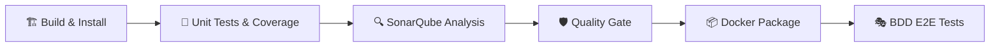

# Guía de Implementación CI/CD con Jenkins, Docker-in-Docker y SonarQube

Esta guía documenta la infraestructura de Integración y Entrega Continua (CI/CD) implementada para los microservicios del Reto 6. Detalla la arquitectura de agentes efímeros basada en Docker-in-Docker (DinD), cómo fluye la información en cada pipeline y qué credenciales utilizar.

---

## 1. Arquitectura General

### 1.1 Principio: Jenkins "Lean" con Agentes Efímeros

A diferencia de un enfoque tradicional donde Jenkins Master incluye todas las herramientas (Node.js, Python, etc.) instaladas directamente en su imagen ("fat agent"), esta implementación sigue el principio de **aislamiento por herramienta**:

- **Jenkins Master** solo contiene el Docker CLI y Docker Compose. No tiene Node.js, Python ni SonarScanner instalados.
- **Cada etapa del pipeline** que requiere una herramienta específica levanta un **contenedor Docker efímero** con la imagen oficial correspondiente (`node:20`, `python:3.11-slim`, `sonarsource/sonar-scanner-cli:5`).
- Al finalizar la etapa, el contenedor efímero se destruye automáticamente.

Este enfoque garantiza reproducibilidad, aislamiento y escalabilidad.

### 1.2 Docker-in-Docker (DinD)

Para que Jenkins pueda orquestar contenedores Docker desde dentro de un contenedor, se utiliza el patrón **Docker-in-Docker (DinD)**:

```
┌─────────────────────────────────────────────────────────────┐
│                    Docker Host (tu Mac)                      │
│                                                              │
│  ┌──────────────┐    TLS/TCP     ┌────────────────────────┐  │
│  │   Jenkins     │◄─────────────►│   docker (DinD)        │  │
│  │  (Master)     │   :2376       │   docker:dind           │  │
│  │              │                │                         │  │
│  │  Solo tiene: │                │  Demonio Docker interno │  │
│  │  - Docker CLI│                │  que levanta agentes:   │  │
│  │  - Compose   │                │  - node:20              │  │
│  └──────┬───────┘                │  - python:3.11-slim     │  │
│         │                        │  - sonar-scanner-cli:5  │  │
│         │ Volumen compartido     └────────────────────────┘  │
│         │ (jenkins_data)                                     │
│         │                                                    │
│  ┌──────▼───────┐  ┌───────────┐  ┌──────────┐              │
│  │  SonarQube   │  │  Registry │  │ sonar-db │              │
│  │  :9000       │  │  :5000    │  │ Postgres │              │
│  └──────────────┘  └───────────┘  └──────────┘              │
└─────────────────────────────────────────────────────────────┘
```

**¿Por qué DinD y no Docker Socket (`docker.sock`)?**

Al montar el socket de Docker del host, los volúmenes que Jenkins intenta mapear dentro de los agentes apuntan a rutas del host (macOS), pero esas rutas no existen en el disco de la Mac (solo dentro del contenedor de Jenkins). DinD resuelve esto porque el demonio interno comparte el mismo volumen `jenkins_data` donde vive el workspace.

### 1.3 Componentes del `docker-compose.ci.yml`

| Servicio | Imagen | Puerto | Función |
|:---|:---|:---|:---|
| `docker` | `docker:dind` | 2376 (interno) | Demonio Docker privado para Jenkins. Ejecuta los agentes efímeros. |
| `jenkins` | Custom (`./jenkins/Dockerfile`) | 8086 → 8080 | Orquestador CI/CD. Se conecta al demonio DinD vía TCP+TLS. |
| `sonarqube` | `sonarqube:10.4.1-community` | 9000 | Análisis de código estático y Quality Gates. |
| `sonar-db` | `postgres:16-alpine` | - | Base de datos de SonarQube. |
| `registry` | `registry:2` | 5000 | Registro Docker privado para almacenar imágenes de los microservicios. |

**Comunicación TLS entre Jenkins y DinD:**

```yaml
# Jenkins se conecta al demonio DinD usando certificados TLS autogenerados
environment:
  DOCKER_HOST: tcp://docker:2376
  DOCKER_CERT_PATH: /certs/client
  DOCKER_TLS_VERIFY: 1
```

> [!IMPORTANT]
> El servicio DinD **debe** llamarse `docker` en el compose. Los certificados TLS autogenerados por `docker:dind` solo son válidos para los hostnames `docker`, `localhost` y el ID del contenedor. Usar otro nombre (ej. `jenkins-docker`) causa errores de verificación x509.

---

## 2. Accesos y Credenciales

| Servicio | URL | Usuario | Contraseña | Notas |
|:---|:---|:---|:---|:---|
| **Jenkins** | `http://localhost:8086` | `admin` | `admin` | Autenticación configurada vía JCasC (`casc.yaml`). |
| **SonarQube** | `http://localhost:9000` | `admin` | `admin` (por defecto) | BD interna: `sonar`/`sonar`. |
| **Registry** | `http://localhost:5000` | - | - | Sin autenticación. Accesible como `registry:5000` desde la red interna. |

> [!IMPORTANT]
> **Resolución de Enlaces SonarQube**
> Jenkins genera enlaces hacia SonarQube usando el hostname interno `sonarqube`. Para que tu navegador los resuelva:
> ```bash
> sudo sh -c 'echo "127.0.0.1 sonarqube" >> /etc/hosts'
> ```

---

## 3. Agentes Docker por Etapa

Cada etapa del pipeline declara su propio agente Docker mediante la directiva `agent { docker { ... } }`. La configuración clave es:

```groovy
agent {
    docker {
        image 'node:20'          // Imagen oficial con la herramienta requerida
        reuseNode true           // Reutiliza el workspace del nodo master
        args '--network host'    // Comparte la red del contenedor DinD
    }
}
```

### 3.1 Imágenes utilizadas

| Imagen | Etapas | Servicio |
|:---|:---|:---|
| `node:20` | Build, Unit Tests, BDD E2E | Employees Service |
| `python:3.11-slim` | Build, Unit Tests | Notifications Service |
| `sonarsource/sonar-scanner-cli:5` | SonarQube Analysis | Ambos servicios |
| `node:20` | BDD E2E | Notifications Service |

### 3.2 ¿Por qué `--network host`?

Los agentes efímeros son contenedores hijos levantados por el demonio DinD. Al usar `--network host`, el agente comparte la interfaz de red del contenedor DinD, el cual sí está conectado a la red externa `microservices-challenges_microservices-network`. Esto le permite resolver nombres DNS como `sonarqube`, `registry`, `employees-service`, etc.

### 3.3 Persistencia de dependencias entre etapas

Cada etapa levanta un contenedor **nuevo y limpio**. Esto tiene implicaciones diferentes según el lenguaje:

**Node.js (employees-service):**
No hay problema. `npm install` almacena las dependencias en `node_modules/` dentro del workspace, que persiste entre etapas gracias a `reuseNode true`.

**Python (notifications-service):**
`pip install` por defecto instala en directorios globales del contenedor (`/usr/local/`), que se destruyen al terminar la etapa. Para resolver esto, se utiliza un entorno virtual con nombre exclusivo para CI:

```groovy
// Etapa Build
sh '''
python3 -m venv venv_ci
. venv_ci/bin/activate
pip install -r requirements.txt
'''

// Etapa Tests (contenedor nuevo, pero venv_ci persiste en el workspace)
sh '''
. venv_ci/bin/activate
pytest --cov=app --cov-report=xml
'''
```

> [!WARNING]
> El entorno virtual se llama `venv_ci` (no `venv`) para evitar conflictos con entornos virtuales locales de desarrollo que pueden existir en el workspace. Un `venv` creado en macOS contiene symlinks a rutas de Mac que no existen dentro de Linux.

---

## 4. Flujo del Pipeline

Ambos servicios (`employees-service` y `notifications-service`) tienen su propio `Jenkinsfile` versionado en la raíz de su carpeta. Las etapas son conceptualmente idénticas:



| # | Etapa | Agente | Descripción |
|:---|:---|:---|:---|
| 1 | **🏗️ Build & Install** | `node:20` / `python:3.11-slim` | Instala dependencias. Node: `npm install && npm run build`. Python: crea `venv_ci` e instala con `pip`. |
| 2 | **🧪 Unit Tests & Coverage** | `node:20` / `python:3.11-slim` | Ejecuta pruebas unitarias y genera reportes de cobertura (`lcov.info` / `coverage.xml`). |
| 3 | **🔍 SonarQube Analysis** | `sonarsource/sonar-scanner-cli:5` | Envía código y reportes de cobertura al servidor SonarQube interno. Usa `sonar-scanner` directamente (sin `SCANNER_HOME`). |
| 4 | **🛡️ Quality Gate** | Master (sin agente Docker) | Jenkins espera (timeout 5 min) la respuesta del Webhook de SonarQube. Si falla, el pipeline se aborta. |
| 5 | **📦 Docker Package** | Master (sin agente Docker) | Construye la imagen de producción y la sube al registro interno (`registry:5000/nombre-servicio`). |
| 6 | **🎭 BDD E2E Tests** | `node:20` | Ejecuta las pruebas funcionales Cucumber contra los microservicios desplegados. Publica el reporte HTML. |

---

## 5. Diferencias Específicas por Servicio

### Employees Service (Node.js / TypeScript)

- **Agente principal:** `node:20`
- **Build:** `npm install` + `npm run build`
- **Tests:** `npm run test:cov` (genera `lcov.info`)
- **SonarQube:** Configurado en `sonar-project.properties`. Analiza archivos `.ts`.
- **Docker Package:** Imagen publicada como `registry:5000/employees-service:<BUILD_NUMBER>` y `:latest`.

### Notifications Service (Python / FastAPI)

- **Agente principal:** `python:3.11-slim`
- **Build:** Crea `venv_ci` e instala dependencias con `pip`.
- **Tests:** `pytest --cov=app --cov-report=xml` (genera `coverage.xml`)
- **SonarQube:** Configurado en `sonar-project.properties`. Analiza archivos `.py`.
- **Docker Package:** Imagen publicada como `registry:5000/notifications-service:<BUILD_NUMBER>` y `:latest`.
- **E2E:** Usa agente `node:20` ya que las pruebas Cucumber están en JavaScript.

---

## 6. Imagen de Jenkins (`jenkins/Dockerfile`)

El Dockerfile de Jenkins es intencionalmente **delgado** ("lean"). Solo instala:

| Componente | Propósito |
|:---|:---|
| `docker.io` | Cliente Docker CLI para comunicarse con el demonio DinD. |
| Docker Compose v2 | Para poder ejecutar `docker compose` en etapas que lo necesiten. |
| Plugins Jenkins | `docker-workflow`, `sonar`, `htmlpublisher`, `configuration-as-code`, etc. |

**No incluye:** Node.js, Python, SonarScanner, ni ninguna otra herramienta de build. Todo eso lo proveen los agentes efímeros.

---

## 7. Registro Docker Interno

El registro (`registry:5000`) almacena las imágenes Docker construidas durante el pipeline.

- **Desde los pipelines:** Se referencia como `registry:5000` (resolución DNS interna de Docker).
- **Desde tu Mac:** Se accede como `localhost:5000`.
- El servicio DinD está configurado con `--insecure-registry registry:5000` para permitir push/pull sin HTTPS.

**Verificar imágenes almacenadas:**
```bash
curl http://localhost:5000/v2/_catalog
```

---

## 8. Checklist de Preparación (Primer Uso)

Si levantas la infraestructura desde cero (`docker compose -f docker-compose.ci.yml down -v`), sigue estos pasos:

### 8.1 Levantar la infraestructura

```bash
# 1. Primero los microservicios (crea la red compartida)
docker compose up --build -d

# 2. Después la infraestructura CI/CD (se conecta a la red existente)
docker compose -f docker-compose.ci.yml up --build -d
```

> [!IMPORTANT]
> El orden importa. La red `microservices-challenges_microservices-network` debe existir antes de levantar el CI, ya que está definida como `external: true` en `docker-compose.ci.yml`.

### 8.2 Configurar SonarQube

1. Ingresa a SonarQube (`http://localhost:9000`) con `admin`/`admin`.
2. Cambia la contraseña cuando te lo pida (o mantén `admin`).
3. Ve a **My Account** → **Security** → **Generate Token**. Crea un token de tipo "User" (nombre sugerido: `jenkins-token`).
4. Copia el token.

### 8.3 Configurar Jenkins

1. Ingresa a Jenkins (`http://localhost:8086`) con `admin`/`admin`.
2. Ve a **Manage Jenkins** → **Credentials** → **System** → **Global credentials**.
3. Añade un **Secret Text** con ID `sonar-token` y pega el token de SonarQube.

### 8.4 Configurar Webhook de SonarQube → Jenkins

1. En SonarQube, ve a **Administration** → **Configuration** → **Webhooks**.
2. Crea un webhook apuntando a:
   ```
   http://jenkins:8080/sonarqube-webhook/
   ```
   > Nota: Se usa el puerto `8080` porque es comunicación interna entre contenedores.

### 8.5 (Opcional) Resolver enlaces de SonarQube en tu navegador

```bash
sudo sh -c 'echo "127.0.0.1 sonarqube" >> /etc/hosts'
```

---

## 9. Troubleshooting

### Error: `x509: certificate is valid for ... not jenkins-docker`
**Causa:** El servicio DinD tiene un nombre diferente a `docker`.
**Solución:** Renombrar el servicio a `docker` en `docker-compose.ci.yml`.

### Error: `No such file or directory: '.../venv/bin/python3'`
**Causa:** Existe una carpeta `venv/` creada en macOS con symlinks a rutas de Mac que no existen en Linux.
**Solución:** El pipeline usa `venv_ci` como nombre del entorno virtual. Agregar `venv_ci/` al `.gitignore`.

### Error: `network ... not found`
**Causa:** Los agentes intentan conectarse a una red Docker que no existe dentro del demonio DinD.
**Solución:** Usar `args '--network host'` en los agentes para heredar la red del contenedor DinD.

### Error: `SonarQube server [http://sonarqube:9000] can not be reached`
**Causa:** El agente de SonarScanner no puede resolver el hostname `sonarqube`.
**Solución:** Verificar que el agente tiene `args '--network host'` y que el contenedor DinD está conectado a la red de microservicios.

### Error: `pytest: not found`
**Causa:** Las dependencias se instalaron en un contenedor efímero previo que ya fue destruido.
**Solución:** Usar un `venv_ci` que persiste en el workspace entre etapas.
